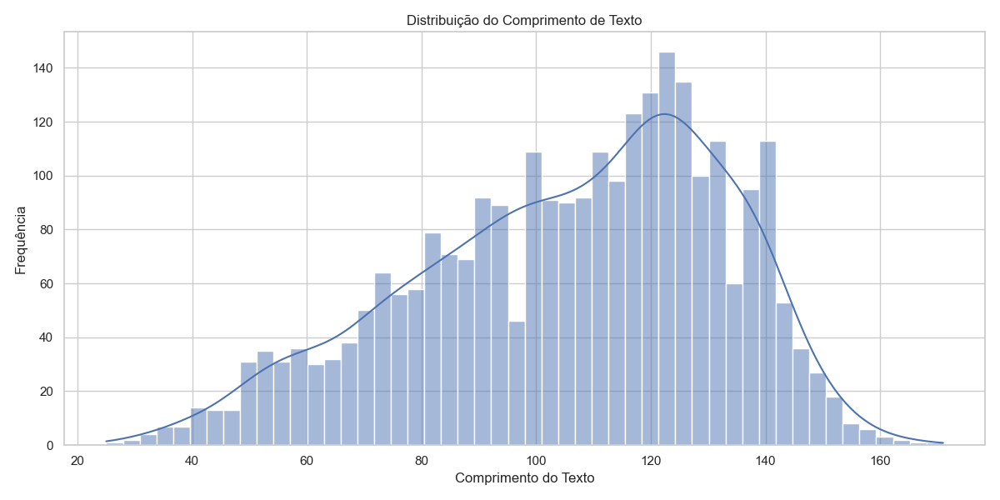
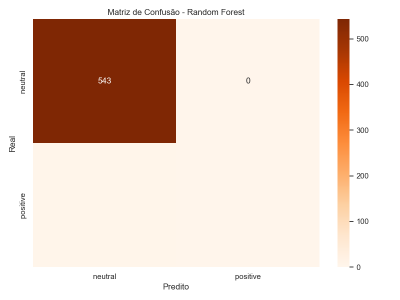

# Senti-Pred

Projeto de análise de sentimentos com processamento de linguagem natural e aprendizado de máquina.

## Visão Geral

O Senti-Pred é um projeto de análise de sentimentos que utiliza técnicas de processamento de linguagem natural e aprendizado de máquina para classificar textos de acordo com o sentimento expresso. O projeto implementa um pipeline completo de análise de dados, desde a exploração inicial até o deploy em produção usando Docker.

## Estrutura do Projeto

```
senti-pred/
├── README.md
├── data/
│   ├── raw/ (dados originais)
│   └── processed/ (dados processados)
├── notebooks/
│   └── full_pipeline.ipynb (Pipeline completo)
├── src/
│   ├── models/ (código dos modelos)
│   ├── api/ (Django API)
│   └── scripts/ (Scripts de processamento)
├── reports/
│   ├── relatorio_tecnico.md
│   └── visualizacoes/ (gráficos e visualizações)
├── requirements.txt
└── docker-compose.yml
```

## Fases do Projeto

O projeto Senti-Pred é dividido em 4 fases principais:

1. **Análise de Dados (EDA)**: Exploração e visualização dos dados para entender padrões e características.
2. **Pré-processamento**: Limpeza e transformação dos dados para prepará-los para modelagem.
3. **Modelagem**: Desenvolvimento e treinamento de modelos de análise de sentimentos.
4. **Avaliação**: Teste e avaliação do desempenho dos modelos desenvolvidos.

## Visualizações e Resultados

### Análise Exploratória

Durante a fase de análise exploratória, foram geradas visualizações para entender melhor os dados:

#### Distribuição do Comprimento dos Textos


#### Distribuição do Número de Palavras


### Avaliação de Modelos

Foram implementados e avaliados diferentes modelos de machine learning:

#### Comparação de Desempenho dos Modelos


#### Métricas de Precisão


#### Matrizes de Confusão

##### Naive Bayes


##### Random Forest


##### Regressão Logística


## Instalação e Configuração

### Pré-requisitos

- Python 3.8+
- Pip (gerenciador de pacotes Python)
- Docker e Docker Compose (para deploy)
- Virtualenv (opcional, mas recomendado)

### Instalação

1. Clone o repositório:
   ```bash
   git clone https://github.com/PedroM2626/Senti-Pred.git
   cd senti-pred
   ```

2. Crie e ative um ambiente virtual (opcional):
   ```bash
   python -m venv venv
   source venv/bin/activate  # No Windows: venv\Scripts\activate
   ```

3. Instale as dependências:
   ```bash
   pip install -r requirements.txt
   ```

4. Configure as variáveis de ambiente:
   ```bash
   cp .env.example .env
   # Edite o arquivo .env com suas configurações
   ```

## Uso

### Pipeline Completo

Execute o notebook principal que contém todo o pipeline:

```bash
jupyter notebook notebooks/full_pipeline.ipynb
```

Este notebook contém todas as etapas do projeto:
- Configuração inicial e carregamento de dados
- Análise exploratória de dados (EDA)
- Pré-processamento de texto
- Treinamento e avaliação de modelos
- Preparação para deploy

### Deploy com Docker

Para implantar o modelo usando Docker:

```bash
docker-compose up -d
```

Isso iniciará a API Django que serve o modelo de análise de sentimentos.

```bash
jupyter notebook notebooks/03_modeling.ipynb
```

Ou treine o modelo diretamente:

```bash
python src/models/sentiment_model.py
```

### API Django

Para iniciar a API Django:

```bash
cd src/api
python manage.py runserver
```

A API estará disponível em `http://localhost:8000/api/`.

## Testes

Execute os testes unitários:

```bash
pytest tests/unit/
```

Execute os testes de integração:

```bash
pytest tests/integration/
```

Execute os testes de aceitação:

```bash
pytest tests/acceptance/
```

## Containerização

Para executar o projeto em contêineres Docker:

```bash
docker-compose up
```

## Contribuição

1. Faça um fork do projeto
2. Crie uma branch para sua feature (`git checkout -b feature/nova-feature`)
3. Faça commit das suas alterações (`git commit -am 'Adiciona nova feature'`)
4. Faça push para a branch (`git push origin feature/nova-feature`)
5. Abra um Pull Request

## Licença

Este projeto está licenciado sob a licença MIT - veja o arquivo LICENSE para detalhes.

## Contato

Para dúvidas ou sugestões, entre em contato através de pedromoratolahoz@gmail.com.