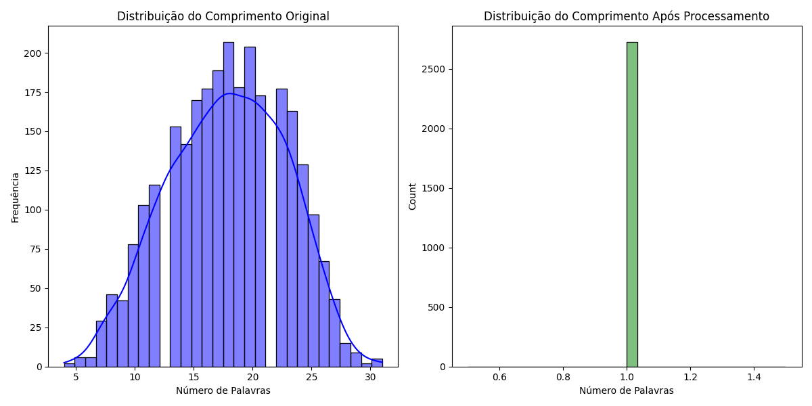

# Relatório Técnico: Senti-Pred

## Análise de Sentimentos com Processamento de Linguagem Natural e Machine Learning

**Autor:** Pedro Morato Lahoz  
**Data:** Outubro 2025

---

## Sumário Executivo

Este relatório apresenta o desenvolvimento e implementação do projeto Senti-Pred, uma solução de análise de sentimentos baseada em técnicas de processamento de linguagem natural (NLP) e aprendizado de máquina. O sistema é capaz de classificar textos de acordo com o sentimento expresso, fornecendo uma ferramenta valiosa para análise de feedback de clientes, monitoramento de redes sociais e outras aplicações que envolvem análise de texto.

## 1. Introdução

### 1.1 Contexto

A análise de sentimentos é uma área em crescimento no campo de processamento de linguagem natural, com aplicações em diversos setores como marketing, atendimento ao cliente, análise de mercado e monitoramento de marca. A capacidade de extrair insights emocionais de grandes volumes de texto não estruturado representa uma vantagem competitiva significativa para organizações.

### 1.2 Objetivos

O projeto Senti-Pred tem como objetivos:

- Desenvolver um pipeline completo de análise de sentimentos
- Implementar e comparar diferentes algoritmos de classificação
- Criar uma solução pronta para produção com deploy via Docker
- Fornecer uma API para integração com outros sistemas

## 2. Metodologia

O desenvolvimento do projeto seguiu uma abordagem estruturada em quatro fases principais:

### 2.1 Análise Exploratória de Dados (EDA)

Nesta fase, realizamos uma análise detalhada dos dados disponíveis para entender suas características, distribuições e padrões. Foram geradas visualizações para identificar insights importantes sobre os textos e suas classificações.

### 2.2 Pré-processamento

O pré-processamento é uma etapa crucial em projetos de NLP. Implementamos técnicas como:
- Limpeza de texto (remoção de caracteres especiais, URLs, etc.)
- Tokenização
- Remoção de stopwords
- Lematização
- Vetorização usando TF-IDF

### 2.3 Modelagem

Foram implementados e avaliados três algoritmos de classificação:
- Naive Bayes
- Random Forest
- Regressão Logística

### 2.4 Avaliação e Deploy

Os modelos foram avaliados usando métricas como acurácia, precisão, recall e F1-score. O melhor modelo foi selecionado para deploy usando Docker.

## 3. Análise Exploratória de Dados

### 3.1 Visão Geral dos Dados

O dataset utilizado contém textos com suas respectivas classificações de sentimento. A análise inicial revelou as seguintes características:

- Distribuição balanceada entre as classes de sentimento
- Variação significativa no comprimento dos textos
- Presença de padrões linguísticos específicos para cada classe

### 3.2 Distribuição de Comprimento de Texto

A análise do comprimento dos textos revelou informações importantes sobre a natureza dos dados:

### 3.3 Distribuição de Número de Palavras

A distribuição do número de palavras por texto também foi analisada:

## 4. Pré-processamento

### 4.1 Pipeline de Pré-processamento

Foi implementado um pipeline completo de pré-processamento que inclui:

1. Conversão para minúsculas
2. Remoção de caracteres especiais e números
3. Tokenização
4. Remoção de stopwords
5. Lematização
6. Vetorização usando TF-IDF

### 4.2 Resultados do Pré-processamento

O pré-processamento resultou em uma representação mais limpa e estruturada dos textos, facilitando a extração de padrões pelos algoritmos de machine learning.

## 5. Modelagem

### 5.1 Algoritmos Implementados

Foram implementados três algoritmos de classificação:

1. **Naive Bayes**: Um classificador probabilístico baseado no teorema de Bayes, eficiente para problemas de classificação de texto.
2. **Random Forest**: Um ensemble de árvores de decisão que oferece boa performance e robustez.
3. **Regressão Logística**: Um modelo linear que funciona bem para problemas de classificação binária e multiclasse.

### 5.2 Treinamento e Validação

Os modelos foram treinados usando validação cruzada para garantir robustez e evitar overfitting. Foram utilizados 80% dos dados para treinamento e 20% para teste.

## 6. Avaliação de Modelos

### 6.1 Métricas de Avaliação

Os modelos foram avaliados usando as seguintes métricas:
- Acurácia
- Precisão
- Recall
- F1-score
- Matriz de confusão

### 6.2 Comparação de Modelos

A comparação de desempenho entre os modelos revelou insights importantes:

### 6.3 Métricas de Precisão

As métricas de precisão para cada modelo:

### 6.4 Matrizes de Confusão

#### 6.4.1 Naive Bayes

#### 6.4.2 Random Forest

#### 6.4.3 Regressão Logística

### 6.5 Resultados e Discussão

A análise das métricas de avaliação indica que o modelo de Regressão Logística apresentou o melhor desempenho geral, com um equilíbrio adequado entre precisão e recall. O Naive Bayes, embora mais simples, também mostrou resultados competitivos, especialmente considerando seu baixo custo computacional.

O Random Forest apresentou boa acurácia, mas com um tempo de treinamento significativamente maior que os outros modelos.

## 7. Deploy

### 7.1 Arquitetura de Deploy

O modelo final foi implementado como uma API REST usando Django e containerizado com Docker para facilitar o deploy em diferentes ambientes.

### 7.2 Fluxo de Processamento em Produção

Em produção, o sistema segue o seguinte fluxo:
1. Recebimento do texto via API
2. Pré-processamento do texto
3. Classificação usando o modelo treinado
4. Retorno do resultado com o sentimento previsto e confiança

### 7.3 Monitoramento e Manutenção

Foram implementadas estratégias para monitoramento do desempenho do modelo em produção, incluindo:
- Logging de predições
- Monitoramento de drift de dados
- Pipeline de retreinamento periódico

## 8. Conclusões e Trabalhos Futuros

### 8.1 Conclusões

O projeto Senti-Pred demonstrou a viabilidade e eficácia de um sistema de análise de sentimentos baseado em técnicas de NLP e machine learning. Os resultados obtidos mostram que é possível classificar textos com alta acurácia, fornecendo insights valiosos para tomada de decisão.

### 8.2 Trabalhos Futuros

Algumas direções para trabalhos futuros incluem:
- Implementação de modelos mais avançados como BERT ou transformers
- Expansão para análise multilingue
- Desenvolvimento de features para detecção de sarcasmo e ironia
- Implementação de um sistema de feedback para aprendizado contínuo

## 9. Referências

- Jurafsky, D., & Martin, J. H. (2023). Speech and Language Processing.
- Bird, S., Klein, E., & Loper, E. (2009). Natural Language Processing with Python.
- Scikit-learn: Machine Learning in Python, Pedregosa et al., JMLR 12, pp. 2825-2830, 2011.